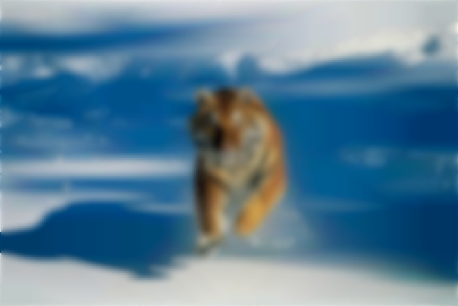

# Bitmap Filter Engine
The goal of this personal project is to transform a 24-bit bitmap image by applying different filters to it. It is a project developed entirely in C, without any external libraries, which manages the binary structure of .bmp files. This project allowed me to deepen my knowledge of memory management and binary data reading, starting from scratch without any external libraries. 

<table style="margin:auto; table-layout:auto;">
  <tr>
    <th style="text-align:center">Original Image</th>
    <th style="text-align:center">Filtered Image (Blur 50)</th>
  </tr>
  <tr>
    <td style="text-align:center">
      
    </td>
    <td style="text-align:center">
      
    </td>
  </tr>
</table>

 ## Features
 **File format :** handles 24-bit bitmap file and alignment padding.  
 **Implemented filters :** grayscale, color inversion, threshold, sepia, convolution blur (with intensity)
 
 ## Technical aspect and algorithms
 A BMP file consists first of a file header and an information header. According to Wikipedia, The file header _is at the start of the file and is used to identify the file. A typical application reads this block first to ensure that the file is actually a BMP file and that it is not damaged. The first 2 bytes of the BMP file format are the character "B" then the character "M" in ASCII encoding._ 
The information header contains the image size, its color palette (here 24 bits, i.e. 16.8 million colors), its compression, etc.

After these headers comes the image, structured in lines, where the number of bytes is a multiple of 4. If there are fewer pixels (for example, a line of 99 bytes), a number of empty bytes must be added to reach the next multiple of 4 (in this case, 1 empty byte must be added).
To calculate this padding, we use modulos, with the following formula :
$p = (4-r \% 4) \%4$ where $p$ is the padding and $r$ the row size.

The blur algorithm is a convolution algorithm. For each pixel in the image, it averages the values of the 8 surrounding pixels and applies this to the central pixel. The original image must therefore be copied into memory, as the unblurred values are needed to apply the filter.

## Project structure
* `/src` : .c files (main.c and filters.c)
* `/include` : .h files (filters.h)
* `/assets` : example image folder
* `Makefile` : for compilation

## Installation and use
**Prerequisites** : GCC, Make  
To compile the project : 
```bash
make
```
To execute the file : 
```bash
./bmp-filter <inputName.bmp> <outputName.bmp> --filterFlag [intensity]
```
For example, to get the example image, copy and paste this command :
```bash
make
./bmp-filter image.bmp output.bmp --blur 50
```
For more information on the filter flags : 
```bash
./bmp-filter --help
```

